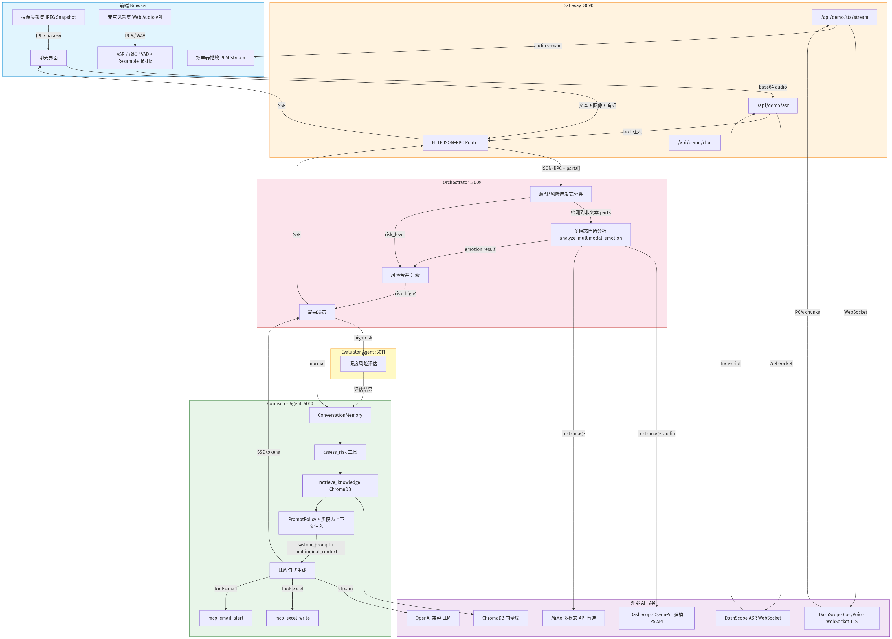

<a id="english"></a>

# mental-agent-runtime

[English](#english) | [中文版](#chinese)

**mental-agent-runtime is an industrial C++ multi-agent runtime for governed mental-health agents.**

This repository packages the current MindBridge runtime implementation under a more direct, interview-facing name: `mental-agent-runtime`.

It is not only a chat demo. The project focuses on the engineering layer around LLM agents: service routing, tool governance, risk evaluation, persisted state, run artifacts, browser-visible QA, and optional eBPF boundary observability.

## Why This Project Matters

mental-agent-runtime is built to answer a practical question:

> How do you turn an LLM-powered mental-health assistant into a runtime that can be routed, audited, evaluated, persisted, and explained?

The strongest parts of the project are:

- **C++ multi-agent runtime**: Gateway, Orchestrator, Counselor, Evaluator, Benchmark, Platform, and demo frontend are wired as real services.
- **Governed tool execution**: tools go through `ToolRegistry -> PermissionChecker -> HookExecutor -> TraceRecorder`, instead of being called as untracked side effects.
- **Mental-health safety loop**: risk routing, evaluator fallback, session-end assessment, and MCP-style Excel/Email actions are integrated into the runtime path.
- **Layered persistence**: conversation state uses `user_id + conversation_id + namespace_name + state_key`; cloud storage uses MySQL, Redis, and FastDFS-style object metadata.
- **Observable runtime artifacts**: every run is expected to write `.mindbridge/runs/<run_id>/task_state.json`, `trace.jsonl`, and `report.json`.
- **eBPF boundary observability**: optional AgentSight-derived process, stdio, file/network/resource, and TLS plaintext tracing is correlated with agent run traces.
- **Verification-oriented engineering**: benchmark tasks, browser QA, platform smoke tests, and a single project verifier keep the demo from becoming a presentation-only prototype.

## Architecture



Main runtime flow:

```text
Frontend / Client
    -> mindbridge_gateway
    -> mindbridge_orchestrator
    -> mindbridge_counselor
    -> mindbridge_evaluator for high-risk or session-end assessment
    -> ToolRegistry / PermissionChecker / HookExecutor / TraceRecorder
    -> Run artifacts, state store, cloud storage, benchmark reports
```

At a high level:

- `mindbridge_gateway` is the HTTP entrypoint, auth/session boundary, storage API surface, and frontend-facing proxy.
- `mindbridge_orchestrator` routes requests, applies lightweight risk/intent logic, and decides when to involve the evaluator.
- `mindbridge_counselor` runs the main counseling path with prompt policy, memory, RAG, tools, and trace recording.
- `mindbridge_evaluator` handles risk assessment, high-risk fallback, and session summary/report behavior.
- `mindbridge_harness` contains the reusable runtime pieces: model clients, tool governance, state, storage, benchmark, observability, and network primitives.

## What The Harness Means

In this repository, **harness** means the engineering layer that sits around the model and turns it into a controlled runtime, rather than a raw prompt-in / text-out wrapper.

The harness is responsible for:

- routing requests across gateway, orchestrator, counselor, and evaluator services
- enforcing tool boundaries through schema validation, permission checks, hooks, and trace recording
- managing runtime state, persisted artifacts, and cloud storage integration
- providing benchmark, browser QA, and observability hooks so behavior can be verified instead of guessed

Concretely, the harness lives mainly under `mindbridge_harness/`, and its reusable core includes `AgentLoop`, `ToolRegistry`, `PermissionChecker`, `HookExecutor`, `TraceRecorder`, `RunStore`, `DistributedStateStore`, and the model / speech / multimodal / observability layers.

## Feature Highlights

| Area | What It Demonstrates | Evidence |
|------|----------------------|----------|
| Industrial entrypoints | Separate C++ services for gateway, orchestrator, counselor, evaluator, platform, and benchmark | `mindbridge_harness/apps/*.cpp` |
| Runtime governance | Tool calls are registered, permission checked, hooked, and traced | `mindbridge_harness/include/mindbridge/harness/`, `mindbridge_harness/src/harness/` |
| Mental-health safety loop | Counselor + Evaluator chain, risk policy, session-end assessment, MCP alert/report path | `mindbridge_harness/apps/orchestrator_main.cpp`, `mindbridge_harness/apps/evaluator_main.cpp`, `mindbridge_harness/src/runtime/risk_policy.cpp` |
| Model abstraction | Ollama, OpenAI-compatible, and DashScope native model clients behind `ModelClient` | `mindbridge_harness/include/mindbridge/model/`, `docs/model_strategy.md` |
| Multimodal interaction | Qwen/DashScope multimodal emotion analysis, ASR, and TTS tools | `mindbridge_harness/src/multimodal/`, `mindbridge_harness/src/speech/`, `frontend/demo/app.js` |
| Distributed state | Master/follower replay and user/conversation/namespace/state-key isolation | `mindbridge_harness/src/state/distributed_state_store.cpp` |
| Cloud storage | Gateway storage endpoints backed by local fake mode or MySQL/Redis/FastDFS live stack | `mindbridge_harness/src/storage/cloud_storage.cpp`, `infra/cloud_storage/` |
| Run artifacts | Structured run outputs for traceability and benchmark verification | `mindbridge_harness/src/runtime/run_store.cpp`, `.mindbridge/runs/<run_id>/` contract |
| eBPF observability | AgentSight-derived process/stdout/TLS tracing with run-level correlation and frontend observability view | `mindbridge_harness/ebpf/agentsight_process/`, `mindbridge_harness/src/observability/`, `frontend/demo/` |
| Benchmark and QA | Harness benchmark, PsychoBench scripts, browser smoke, sandbox browser QA | `mindbridge_harness/benchmarks/mindbridge_tasks.json`, `benchmarks/psycho_bench/`, `sandbox/browser_qa/`, `scripts/verify_*.sh` |
| Cloud-native platform MVP | Workspace, AgentCore, AgentSession, UniversalEvent mapping, K8s manifests | `mindbridge_harness/src/platform/`, `k8s/`, `scripts/k8s-platform-deploy.sh` |

## Runtime Governance

mental-agent-runtime treats the model as one component inside a governed runtime, not as the whole system.

Tool execution follows this boundary:

```text
ToolRegistry
    -> schema + validation
    -> PermissionChecker
    -> HookExecutor
    -> TraceRecorder
    -> structured ToolResult
```

This is important for mental-health workflows because external actions such as alerting, reporting, retrieval, speech, or storage should be auditable. The design also keeps MCP as a tool protocol integrated through `ToolRegistry`; it is not modeled as a standalone `ToolAgent`.

## State, Storage, and Artifacts

mental-agent-runtime uses three different persistence layers for different jobs:

| Layer | Purpose |
|-------|---------|
| `ConversationMemory` / context manager | Short-term prompt-window context and structured conversation memory |
| `DistributedStateStore` | Durable agent state with `user_id + conversation_id + namespace_name + state_key` isolation and follower replay |
| Cloud storage | File/object metadata and chunk upload state through MySQL, Redis, and FastDFS-compatible storage |

Run artifacts are written under:

```text
.mindbridge/runs/<run_id>/
    task_state.json
    trace.jsonl
    report.json
    ebpf_events.jsonl           # optional
    boundary_trace.jsonl        # optional
    observability_report.json   # optional
```

These artifacts make the project easier to inspect in an interview: the runtime can show what happened, which tool path was used, which risk route was selected, and what the benchmark validated.

## eBPF Boundary Observability

mental-agent-runtime includes an optional observability path inspired by AgentSight. It correlates semantic agent events with low-level runtime actions.

Implemented pieces include:

- process lifecycle tracing through `process_new`
- file/network/resource extension probes
- stdout/stderr capture through `stdiocap`
- optional TLS plaintext capture through `sslsniff`, guarded by PID or command filters
- correlation into `boundary_trace.jsonl` and `observability_report.json`
- frontend observability panels for run-level inspection

The eBPF path is default-off and does not block the normal counseling flow. It is designed as runtime observability, not as a separate agent and not as an MCP tool.

## Quick Start

Build and verify the default project path:

```bash
bash scripts/verify_mindbridge.sh
```

Manual build:

```bash
cmake -S . -B build -DBUILD_TESTING=OFF
cmake --build build --target mindbridge_harness mindbridge_gateway mindbridge_orchestrator mindbridge_counselor mindbridge_evaluator mindbridge_benchmark ai_counselor_agent ai_evaluator_agent -j2
./build/mindbridge_harness/mindbridge_benchmark
```

Run with a remote OpenAI-compatible model:

```bash
bash scripts/start_demo_openai.sh
```

Run with DashScope native mode:

```bash
bash scripts/start_demo_dashscope.sh
```

Both remote startup scripts set `MINDBRIDGE_REQUIRE_REMOTE_MODEL=1` so the demo does not silently fall back to local Ollama when remote model configuration is required.

## Verification Matrix

| Command | Purpose |
|---------|---------|
| `bash scripts/verify_mindbridge.sh` | Main build, benchmark, and regression verifier |
| `./build/mindbridge_harness/mindbridge_benchmark` | Harness contract and hardness benchmark |
| `bash scripts/verify_cloud_storage_smoke.sh` | Local fake storage endpoint smoke |
| `MINDBRIDGE_STORAGE_BACKEND=cloud bash scripts/verify_cloud_storage_live.sh` | MySQL/Redis/FastDFS live storage verification |
| `bash scripts/verify_state_mysql_live.sh` | MySQL-backed distributed state verification |
| `bash scripts/verify_platform_browser_smoke.sh` | Browser-visible platform console smoke |
| `bash scripts/verify_sandbox_browser_qa.sh` | Sandbox/browser QA dry-run and unit checks |
| `bash scripts/verify_ebpf_live.sh` | Live kernel eBPF verification on supported Linux hosts |

## Benchmark Results

mental-agent-runtime includes a psychology-oriented benchmark path under `benchmarks/psycho_bench/`.

The evaluation setup uses:

- **85 scenarios** across counseling, education, family, social, career, crisis, and related mental-health topics
- **7 judged dimensions**: Active Listening, Empathy, Safety, Open-mindedness, Clarity, Boundaries, Holistic Approach
- **1-10 ordinal scores per dimension**
- **GRM scoring** through `run_grm.py`, which fits a Graded Response Model instead of collapsing scores into pass/fail

Current GRM summary from `benchmarks/psycho_bench/data/grm/agent_abilities.csv`:

| Agent | Theta | Mean Judge Score | Responses |
|------|------:|-----------------:|----------:|
| `mindbridge` | `0.442` | `8.888` | `85` |
| `qwen-raw` | `0.415` | `8.792` | `85` |
| `doubao-raw` | `-0.216` | `8.343` | `85` |
| `deepseek-raw` | `-0.451` | `8.215` | `85` |

Under this benchmark configuration, MindBridge scores above the raw baseline models and clears the repository's `qwen-raw + 2%` GRM target (`theta_ratio_vs_best_raw = 1.064`, `meets_2pct_target = True`).

## Repository Map

| Path | Role |
|------|------|
| `mindbridge_harness/` | Main industrial C++ agent runtime |
| `frontend/demo/` | Browser demo, storage dashboard, observability/platform views |
| `examples/mindcare/` | Runnable regression demo that should remain compatible |
| `docs/` | Architecture, engineering, model strategy, deployment, benchmark notes |
| `scripts/` | Startup, shutdown, browser QA, storage, platform, eBPF, and verification scripts |
| `infra/cloud_storage/` | Project-owned MySQL/Redis/FastDFS-style storage stack |
| `k8s/` | Cloud-native platform manifests and eBPF opt-in profile |
| `sandbox/browser_qa/` | Browser QA harness and fake model server |
| `benchmarks/psycho_bench/` | PsychoBench-related evaluation scripts and data |
| `integrations/mcp_server_integrated/` | MCP server reference with Excel/Email-style plugins |
| `a2a/`, `a2a_adapter/`, `mcp/`, `orchestrator/`, `proto/`, `common/` | Local C++ dependencies used by the harness and demo |
| `include/`, `src/`, `server/`, `client/` | Legacy/general RPC framework components kept for inspection and optional repair |

External reference projects from the original workspace, such as `OpenHarness/`, `agentscope/`, `deer-flow`, `AutoAI-Coding/`, and `pico-hardness/`, are intentionally not bundled in this repository.

## Configuration Notes

Model access is kept behind the `ModelClient` abstraction.

Common environment variables:

```bash
export MINDBRIDGE_MODEL_PROVIDER=dashscope_native
export MINDBRIDGE_MODEL_NAME=qwen-plus
export DASHSCOPE_API_KEY=...
```

or:

```bash
export MINDBRIDGE_MODEL_PROVIDER=openai_compatible
export MINDBRIDGE_MODEL_BASE_URL=https://api.example.com/v1
export MINDBRIDGE_MODEL_API_KEY=...
export MINDBRIDGE_MODEL_NAME=qwen-plus
```

API keys should be supplied through environment variables or hidden script prompts. Do not commit real keys.

## Interview Framing

A concise way to explain the project:

> mental-agent-runtime is an industrial-grade C++ agent harness for a mental-health assistant. My focus was not only prompt quality, but the runtime around the model: multi-service routing, risk evaluation, governed tool execution, persisted state, cloud storage, benchmark verification, browser QA, and optional eBPF observability. The result is a system that can be demonstrated, inspected, and debugged like an engineered agent platform rather than a single LLM wrapper.

What it is honest to claim:

- implemented C++ runtime entrypoints and demo services
- implemented tool governance and trace artifacts
- implemented risk/evaluator flow and mental-health-specific prompt policy
- implemented state isolation and storage integration paths
- implemented browser-visible demo, platform MVP pieces, benchmark, and QA scripts
- implemented optional eBPF observability path on supported Linux hosts

What remains future work:

- stronger production auth/RBAC and rate limiting
- fuller CI coverage for all live provider paths
- broader live K8s deployment verification
- deeper automated browser screenshot regression for observability dashboards

## Documentation

- [Architecture](docs/architecture.md)
- [Harness Engineering](docs/harness_engineering.md)
- [Model Strategy](docs/model_strategy.md)
- [Deployment](docs/deployment.md)
- [Repository Map](REPO_MAP.md)
- [MindBridge Harness README](mindbridge_harness/README.md)

---

<a id="chinese"></a>

# mental-agent-runtime 中文版

[English](#english) | [中文版](#chinese)

**mental-agent-runtime 是一个面向心理健康智能体的工业级 C++ 多智能体运行时。**

这个仓库对外展示名使用 `mental-agent-runtime`，内部实现主体仍然是当前的 MindBridge runtime。

它不只是一个聊天 Demo。这个项目的重点是把 LLM 包进一套可路由、可审计、可评测、可持久化、可观测的工程运行时里，包括服务编排、工具治理、风险评估、状态存储、运行产物、浏览器可见 QA，以及可选的 eBPF 边界观测。

## 这个项目的价值

mental-agent-runtime 想解决的核心问题是：

> 怎样把一个基于大模型的心理健康助手，做成一个可以解释、验证、追踪和演示的工程化 Agent Runtime？

这个仓库最有技术含量的部分包括：

- **C++ 多智能体运行时**：包含 Gateway、Orchestrator、Counselor、Evaluator、Benchmark、Platform 和前端 Demo。
- **受治理的工具调用链**：工具执行统一经过 `ToolRegistry -> PermissionChecker -> HookExecutor -> TraceRecorder`，不是随意外调。
- **心理健康安全闭环**：包含风险路由、Evaluator 兜底、会话结束评估，以及 MCP 风格的 Excel / Email 工具链路。
- **分层持久化设计**：会话状态采用 `user_id + conversation_id + namespace_name + state_key` 隔离，附件存储走 MySQL、Redis、FastDFS 风格链路。
- **运行产物可追踪**：每次 run 都要求落盘 `.mindbridge/runs/<run_id>/task_state.json`、`trace.jsonl`、`report.json`。
- **eBPF 边界观测**：可选接入 AgentSight 风格的进程、stdio、文件/网络/资源、TLS 明文观测，并和运行 trace 关联。
- **验证优先的工程方式**：项目内置 benchmark、browser QA、platform smoke test 和统一 verify 脚本，避免只剩展示层。

## 架构概览


主链路可以概括为：

```text
Frontend / Client
    -> mindbridge_gateway
    -> mindbridge_orchestrator
    -> mindbridge_counselor
    -> high-risk / session-end 时进入 mindbridge_evaluator
    -> ToolRegistry / PermissionChecker / HookExecutor / TraceRecorder
    -> run artifacts / state store / cloud storage / benchmark
```

各层职责：

- `mindbridge_gateway`：HTTP 入口、鉴权/会话边界、前端代理、存储 API。
- `mindbridge_orchestrator`：意图/风险轻路由，决定何时进入 evaluator。
- `mindbridge_counselor`：咨询主链路，负责 prompt、memory、RAG、tools、trace。
- `mindbridge_evaluator`：高风险评估、会话结束评估、兜底决策。
- `mindbridge_harness`：承载模型抽象、工具治理、状态、存储、benchmark、observability、网络层等通用运行时能力。

## Harness 是什么

这里说的 **harness**，不是一个模糊的包装词，而是围绕模型建立起来的工程运行时层。它的作用是把“模型调用”变成“可路由、可治理、可观测、可验证”的系统。

在这个项目里，harness 主要负责：

- 把请求编排到 gateway、orchestrator、counselor、evaluator 这些服务
- 把工具调用收敛到 schema 校验、权限控制、hook 和 trace 审计链里
- 管理运行时状态、run artifacts、云存储链路
- 给 benchmark、browser QA、observability 提供统一的验证和复盘入口

对应实现主要在 `mindbridge_harness/` 下，核心组件包括 `AgentLoop`、`ToolRegistry`、`PermissionChecker`、`HookExecutor`、`TraceRecorder`、`RunStore`、`DistributedStateStore`，以及模型、语音、多模态、可观测性等运行时模块。

## 特色能力

| 模块 | 说明 | 证据 |
|------|------|------|
| 工业级入口服务 | 独立的 gateway / orchestrator / counselor / evaluator / platform / benchmark | `mindbridge_harness/apps/*.cpp` |
| Runtime 治理 | 工具注册、权限控制、hook、trace 审计链 | `mindbridge_harness/include/mindbridge/harness/`, `mindbridge_harness/src/harness/` |
| 心理健康安全闭环 | Counselor + Evaluator 风险链路、session-end 评估、MCP 告警/报表 | `mindbridge_harness/apps/orchestrator_main.cpp`, `mindbridge_harness/apps/evaluator_main.cpp` |
| 模型抽象层 | `ModelClient` 屏蔽 Ollama、OpenAI-compatible、DashScope native 差异 | `mindbridge_harness/include/mindbridge/model/`, `docs/model_strategy.md` |
| 多模态能力 | 情绪分析、ASR、TTS、前端多媒体交互 | `mindbridge_harness/src/multimodal/`, `mindbridge_harness/src/speech/`, `frontend/demo/app.js` |
| 分布式状态 | master/follower replay，用户/会话/namespace/state_key 隔离 | `mindbridge_harness/src/state/distributed_state_store.cpp` |
| 云存储链路 | Gateway 存储接口 + MySQL / Redis / FastDFS 风格后端 | `mindbridge_harness/src/storage/cloud_storage.cpp`, `infra/cloud_storage/` |
| Run 产物 | 可复盘的 task state、trace、report | `mindbridge_harness/src/runtime/run_store.cpp` |
| eBPF 观测 | AgentSight 风格的运行时边界观测和前端视图 | `mindbridge_harness/ebpf/agentsight_process/`, `mindbridge_harness/src/observability/` |
| 评测与 QA | Harness benchmark、PsychoBench、browser smoke、sandbox QA | `mindbridge_harness/benchmarks/mindbridge_tasks.json`, `benchmarks/psycho_bench/`, `sandbox/browser_qa/` |
| 平台化 MVP | Workspace / AgentSession / UniversalEvent / K8s 部署骨架 | `mindbridge_harness/src/platform/`, `k8s/`, `scripts/k8s-platform-deploy.sh` |

## 工具治理

mental-agent-runtime 的重点不是“直接调用模型”，而是把模型放在一个受治理的 runtime 内部。

工具执行边界如下：

```text
ToolRegistry
    -> schema + validation
    -> PermissionChecker
    -> HookExecutor
    -> TraceRecorder
    -> structured ToolResult
```

这对心理健康场景很关键，因为告警、报表、检索、语音、存储这类外部动作都应该可审计。MCP 在这里被视为工具协议层，而不是独立的 `ToolAgent`。

## 状态、存储与运行产物

项目里有三层持久化职责：

| 层级 | 作用 |
|------|------|
| `ConversationMemory` / context manager | 短期上下文和结构化对话记忆 |
| `DistributedStateStore` | 可持久化、可复制的运行时状态 |
| Cloud storage | 附件对象、分片上传状态、对象元数据 |

Run 产物目录约定：

```text
.mindbridge/runs/<run_id>/
    task_state.json
    trace.jsonl
    report.json
    ebpf_events.jsonl
    boundary_trace.jsonl
    observability_report.json
```

这部分是面试里很能体现深度的地方，因为它说明系统不是只返回一段文本，而是能追踪整个 runtime 行为。

## eBPF 边界观测

mental-agent-runtime 支持可选的 AgentSight 风格运行时观测，核心能力包括：

- `process_new` 进程生命周期观测
- 文件 / 网络 / 资源扩展探针
- `stdiocap` 标准输入输出捕获
- `sslsniff` TLS 明文捕获
- `boundary_trace.jsonl` 与 `observability_report.json` 关联分析
- 前端 Observability 视图

这条链路默认关闭，不影响正常咨询流程。它是 runtime observability 组件，不是新的 agent。

## 快速开始

统一验证入口：

```bash
bash scripts/verify_mindbridge.sh
```

手动构建：

```bash
cmake -S . -B build -DBUILD_TESTING=OFF
cmake --build build --target mindbridge_harness mindbridge_gateway mindbridge_orchestrator mindbridge_counselor mindbridge_evaluator mindbridge_benchmark ai_counselor_agent ai_evaluator_agent -j2
./build/mindbridge_harness/mindbridge_benchmark
```

远程 OpenAI-compatible 启动：

```bash
bash scripts/start_demo_openai.sh
```

DashScope native 启动：

```bash
bash scripts/start_demo_dashscope.sh
```

这两个远程启动脚本都会设置 `MINDBRIDGE_REQUIRE_REMOTE_MODEL=1`，避免悄悄回退到本地 Ollama。

## 验证矩阵

| 命令 | 作用 |
|------|------|
| `bash scripts/verify_mindbridge.sh` | 主验证入口，覆盖构建和核心回归 |
| `./build/mindbridge_harness/mindbridge_benchmark` | Harness contract / hardness benchmark |
| `bash scripts/verify_cloud_storage_smoke.sh` | 本地 fake storage 冒烟 |
| `MINDBRIDGE_STORAGE_BACKEND=cloud bash scripts/verify_cloud_storage_live.sh` | MySQL / Redis / FastDFS live 验证 |
| `bash scripts/verify_state_mysql_live.sh` | MySQL-backed state store 验证 |
| `bash scripts/verify_platform_browser_smoke.sh` | 浏览器可见 platform smoke test |
| `bash scripts/verify_sandbox_browser_qa.sh` | sandbox browser QA |
| `bash scripts/verify_ebpf_live.sh` | Linux 主机上的 live eBPF 验证 |

## Benchmark 效果

mental-agent-runtime 在 `benchmarks/psycho_bench/` 下带了一套面向心理咨询场景的 benchmark。

评测口径是：

- **85 个场景**
- **7 个打分维度**：Active Listening、Empathy、Safety、Open-mindedness、Clarity、Boundaries、Holistic Approach
- **每个维度 1-10 分**
- **使用 GRM 打分**：通过 `run_grm.py` 拟合 Graded Response Model，而不是简单做 pass/fail 二值化

当前 `benchmarks/psycho_bench/data/grm/agent_abilities.csv` 的结果是：

| Agent | Theta | 平均 Judge 分数 | 样本数 |
|------|------:|----------------:|------:|
| `mindbridge` | `0.442` | `8.888` | `85` |
| `qwen-raw` | `0.415` | `8.792` | `85` |
| `doubao-raw` | `-0.216` | `8.343` | `85` |
| `deepseek-raw` | `-0.451` | `8.215` | `85` |

在这套 benchmark 配置下，MindBridge 的结果高于几个基座模型，并且达到了仓库里定义的 `qwen-raw + 2%` GRM 目标：`theta_ratio_vs_best_raw = 1.064`，`meets_2pct_target = True`。

## 仓库结构

| 路径 | 角色 |
|------|------|
| `mindbridge_harness/` | 核心 C++ agent runtime |
| `frontend/demo/` | 浏览器 demo、storage dashboard、observability / platform 视图 |
| `examples/mindcare/` | 必须保持可运行的回归 demo |
| `docs/` | 架构、工程、模型策略、部署、benchmark 文档 |
| `scripts/` | 启停、QA、storage、platform、eBPF、验证脚本 |
| `infra/cloud_storage/` | 项目内云存储编排 |
| `k8s/` | 平台化部署与 eBPF opt-in profile |
| `sandbox/browser_qa/` | 浏览器 QA harness |
| `benchmarks/psycho_bench/` | PsychoBench 评测脚本与数据 |
| `integrations/mcp_server_integrated/` | MCP 服务端参考实现 |
| `a2a/`, `a2a_adapter/`, `mcp/`, `orchestrator/`, `proto/`, `common/` | 本地 C++ 依赖子树 |
| `include/`, `src/`, `server/`, `client/` | 旧版/通用 RPC framework 代码 |

## 面试表述

一句适合面试时直接说的话：

> mental-agent-runtime 是一个面向心理健康智能体的工业级 C++ agent harness。我做的不只是 prompt 或聊天逻辑，而是围绕模型构建了多服务编排、风险评估、工具治理、状态持久化、云存储、benchmark、浏览器 QA 和可选 eBPF 可观测性，让它更像一个可验证、可解释、可调试的 Agent Runtime。

可以诚实宣称的内容：

- 已实现 C++ runtime 入口服务和前端 demo
- 已实现工具治理和 trace artifact 链路
- 已实现风险评估与 evaluator 兜底
- 已实现状态隔离和云存储集成
- 已实现 benchmark、browser QA、platform MVP
- 已实现可选 eBPF 观测链路

仍属于下一步工作的内容：

- 更完整的生产级 auth / RBAC / rate limit
- 更强的 live provider CI 覆盖
- 更完整的 K8s live 验证
- 更深入的 observability 前端回归测试

## 相关文档

- [Architecture](docs/architecture.md)
- [Harness Engineering](docs/harness_engineering.md)
- [Model Strategy](docs/model_strategy.md)
- [Deployment](docs/deployment.md)
- [Repository Map](REPO_MAP.md)
- [MindBridge Harness README](mindbridge_harness/README.md)
