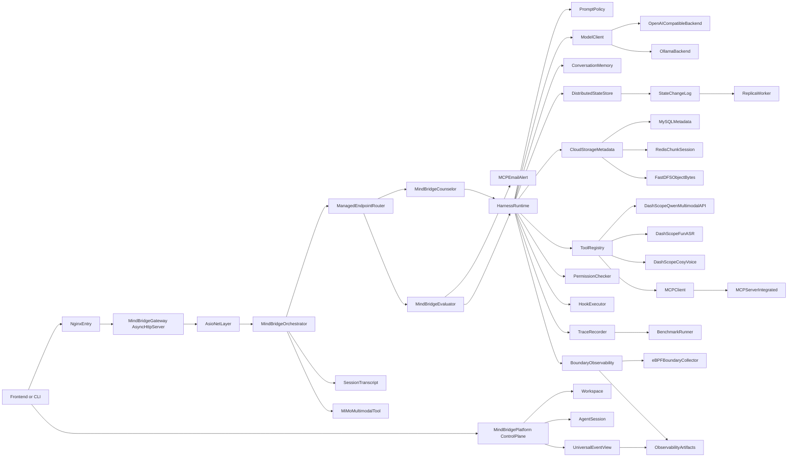

# MindBridge 工业级 C++ Agent 架构

## 概述

MindBridge 当前采用“统一入口 + 编排 + 专业 Agent + Harness Runtime + 工具协议”的分层架构。
主链路如下：

1. `mindbridge_gateway`：统一入口、request_id 注入、鉴权占位、错误格式统一；正式入口服务端使用 `mindbridge::net::AsyncHttpServer`，基于 Boost.Asio/Beast 的 `async_accept/read/write` 和多 `io_context` worker。
2. `mindbridge_orchestrator`：编排入口，先做轻量意图/风险路由，高风险时调用 Evaluator，再按 `contextId` 路由 Counselor，并把评估结果合并回响应；同时记录最近会话 transcript，显式 `session/end` 时无论风险高低都会触发 Evaluator 生成阶段性评估并发送 MCP 总结报告。
   共享路由层支持先按 skill/tag 过滤候选，再按一致性哈希做 `contextId/session_id` 级实例亲和；正式入口可通过 `MINDBRIDGE_COUNSELOR_URLS` / `MINDBRIDGE_EVALUATOR_URLS` 配置多副本 URL 列表。
   Gateway 与 Orchestrator 的下游通信由 `mindbridge::net` 管理：Boost.Asio/Beast HTTP/HTTPS client、主动 `/api/health` 探测、失败摘除、熔断窗口和恢复后重新加入一致性哈希环。
3. `mindbridge_counselor`：咨询主链路，接入 `PromptPolicy`、RAG、记忆、工具调用。
4. `mindbridge_evaluator`：风险评估、高风险兜底，以及会话结束后的阶段性心理状态评估和 MCP 总结报告投递。
5. `ToolRegistry` + 多模态/语音/MCP：工具能力层（Qwen 多模态情绪分析、ASR、TTS、Excel、Email 等）。
6. `TraceRecorder` + benchmark：可观测与评测闭环。
7. `DistributedStateStore`：正式 Counselor 主链路默认接入的分布式状态层，用主写 change log、从节点增量 replay 和幂等应用同步 Agent 会话记忆。
8. `CloudStorage`：MindBridge 自有 FastDFS + MySQL + Redis 分层；FastDFS 保存文件本体，MySQL 保存持久元数据，Redis 保存分片上传会话和断点续传热状态。
9. `BoundaryObservability`：可选 eBPF 边界观测层。它参考 AgentSight 的 boundary tracing 思路，把 MindBridge `TraceRecorder`/`ModelClient` 语义流与 eBPF 动作流关联，输出 run 级 observability artifacts 和前端调试视图。
10. `mindbridge_platform`：云原生 Agent Platform MVP 控制面，管理 Workspace、AgentCore、AgentSession，并把 run trace、artifact 和 observability 输出归一为 Universal Event。该服务不绕过 MindBridge 主链路；它只负责编排和只读聚合。

## 云原生平台化 MVP

MindBridge 平台化采用控制面与数据面分离：

- 控制面：`mindbridge_platform` 保存平台元数据，提供 `/api/platform/*` API，管理 `Workspace`、`AgentCore`、`AgentSession`，并读取 `.mindbridge/runs/<run_id>/` 生成 Universal Event。
- 数据面：现有 Gateway、Orchestrator、Counselor、Evaluator、ToolRegistry、DistributedStateStore、CloudStorage 和 BoundaryObservability。数据面仍执行真正的 Agent 请求、工具权限、状态写入和 run artifact 生成。
- 运行边界：MVP 的远程 Session 是“只读/受控能力”，不开放任意 shell，也不提供全量服务器文件浏览。平台只暴露当前 session 绑定的 artifacts、存储文件、trace 派生事件和 observability 摘要。

平台资源模型：

- `Workspace`：用户或团队级隔离单元，包含 owner、K8s namespace 名和资源配额描述。
- `AgentCore`：可接入的 Agent runtime 类型；v1 只实现 `type=mindbridge`，默认指向 `mindbridge_gateway`。
- `AgentSession`：Workspace 下的一次远程 Agent 会话，绑定 `user_id`、`conversation_id`、`agent_core_id`、状态和最近 `run_id`。
- `UniversalEvent`：UI 面向平台的统一事件模型，把 `run_started`、`model_requested`、工具事件、`run_finished`、artifact 和 observability 归一为 `session.run.started`、`model.requested`、`tool.event`、`session.run.finished`、`artifact.created`、`observability.updated` 等类型。

K8s 侧默认部署 `platform`、`gateway`、`orchestrator`、`counselor`、`evaluator` 和 `frontend`。特权 eBPF DaemonSet 不在 base profile 中默认启用，而是放在 `k8s/profiles/ebpf/`，避免平台 MVP 默认要求宿主机级权限。

## 多模态 V1

MindBridge V1 多模态不新增独立 Agent，而是在 Orchestrator 中通过
`ToolRegistry` 调用 `analyze_multimodal_emotion`。该工具默认使用 DashScope/Qwen
多模态 API 分析 ASR 文本和摄像头抓拍图片，并返回结构化
`text_emotion`、`visual_emotion`、`audio_emotion`、`final_emotion`、`risk_level`
和 `weighted_score`。

视频通话的语音链路由 Gateway 先调用 `recognize_speech` 工具识别文字，前端展示
识别文本后再发送给 Agent。助手回复后，Gateway 通过 `synthesize_speech` 工具调用
DashScope CosyVoice 合成语音。

融合结果只作为风险先验和上下文证据：Orchestrator 用它参与 Evaluator 路由，
Counselor/Evaluator 将它注入提示上下文；高风险外部动作仍通过现有
Evaluator + `mcp_email_alert` 兜底链路执行。

## 当前推荐架构图



## eBPF 边界观测

MindBridge 的 eBPF 观测能力不是新的 Agent，也不是 MCP 工具。它是 Harness runtime 的可选可观测组件，默认关闭，不影响普通 demo 和 CI 构建。

设计参考 AgentSight，但按 MindBridge 现有边界落地：

- A2L：`ModelClient`/`TraceRecorder` 提供模型请求元信息；`sslsniff` TLS uprobe 可选捕获 HTTPS 加密前/解密后的明文，默认关闭，并要求 PID 或 command 过滤。
- A2T Command：通过 eBPF helper 采集 exec/fork/exit、stdio 摘要和子进程树。
- A2T Network：采集 connect/accept、协议和 endpoint 摘要，用于观察模型 API、工具 API 和服务间调用。
- TLS Plaintext：通过 OpenSSL/GnuTLS/NSS uprobe 显示受控进程的 HTTPS 明文片段，用于调试模型网关、工具外联和敏感信息泄漏。
- MCP Stdio：只旁路观测 JSON-RPC `tools/call` 摘要；MCP 仍必须经 `ToolRegistry -> PermissionChecker -> HookExecutor -> TraceRecorder`。
- A2A：结合应用 trace 与 eBPF 网络/进程事件观察 Gateway、Orchestrator、Counselor、Evaluator 的调用链。

真实 eBPF 低层源码 vendoring 在 `mindbridge_harness/ebpf/agentsight_process/`，包含 AgentSight `process_new.bpf.c`、`process_new.c`、文件/网络/资源扩展头文件、`stdiocap.*` 和 `sslsniff.*`；MindBridge 只替换上层 collector、关联、存储、API 和前端。

每次 run 额外生成 `.mindbridge/runs/<run_id>/ebpf_events.jsonl`、`boundary_trace.jsonl` 和 `observability_report.json`。`BoundaryTraceCorrelator` 在 run 完成后用轻量启发式规则把语义 trace 与 eBPF 动作流关联：优先使用 `CLOCK_SYNC` 对齐 wall clock，按时间窗口、参数引用匹配和 PID/PPID 进程血缘给 action 打分，未关联的普通 syscall 仍保留在原始 `ebpf_events.jsonl`，但不再默认淹没前端时间线。

Gateway 通过 `/api/demo/runs/latest/observability` 与 `/api/demo/runs/{run_id}/observability` 暴露只读数据，前端 `Observability` tab 展示采集点全景、进程树、可过滤/缩放时间线、CPU/Memory 轻量 dashboard、TLS 明文片段和事件日志。

## 分布式状态同步 MVP

MindBridge 的 `DistributedStateStore` 用于把 Agent Runtime 的关键状态从单进程内存扩展为可复制状态。正式 `mindbridge_counselor` 默认创建 master store，并把 `conversation_memory_write` 同步写入 records 与 changes；同时启动 follower store 和后台 `ReplicaWorker`，按 `change_id` 周期性拉取并按 `version` 幂等应用。SQLite 仍是默认本地后端，运行时会形成 master/follower 两个 DB 文件；设置 `MINDBRIDGE_STATE_BACKEND=mysql` 时使用 MySQL 的 `mb_state_records`、`mb_state_changes`、`mb_replica_progress`。

状态隔离边界是 `user_id + conversation_id + namespace_name + state_key`。其中 `namespace_name` 用于区分 `chat_memory`、`consult_memory`、`risk_memory`、`run_artifact` 等状态类型，避免不同登录用户、不同会话、不同风险等级的记忆互相串扰。未登录用户只能落到 `anonymous` 用户边界下，正式心理咨询和高风险记忆应由登录链路注入真实 `user_id`。

正式网页对话历史查询链路是 Frontend -> Gateway -> master `DistributedStateStore`，Gateway 的 `/api/conversations` 只聚合 `chat_memory`、`consult_memory` 和 `risk_memory`，不再维护独立前端历史表。这样用户发完一轮对话后刷新左侧 Stored History 可以读到同一条主写状态链路。Follower 读只允许在校验 `mb_replica_progress.last_applied_change_id` 追上目标 change 后使用，否则必须等待或回退 master。

MVP 不宣称 Raft/强一致；它提供的是适合 Agent 会话状态的主写从读、WAL/change log、离线追赶和重复 replay 幂等能力。状态能力仍通过 `ToolRegistry` 暴露，MCP 继续作为工具协议层，不新增 `ToolAgent`。

## 云存储融合

云存储不替代会话一致性层，而是承载运行附件和产物。文件上传链路现在由 MindBridge 项目内 `infra/cloud_storage` 自有编排提供：小文件直接上传到对象存储（`MINDBRIDGE_STORAGE_BACKEND=cloud` 时为 FastDFS，CI 为本地 fake object store），大文件用 Redis/Fake session `mb:chunk:{upload_id}` 保存 `uploaded` 分片索引并支持断点续传，合并后把 `md5/file_id/url/size/type/ref_count` 写入 `mb_file_info`，并把用户作用域引用写入 `mb_user_file_list`。

对象元数据同时通过 `mb_storage_change_tasks` 补偿任务幂等写入 `DistributedStateStore` 的 `run_artifact` namespace，这样 master/follower 复制的是可审计的元数据和用户边界，FastDFS 只负责字节存取。Redis 是临时状态，不作为最终一致性的来源；MySQL 是文件元数据、补偿任务和 MySQL-backed state store 的持久来源。

## 设计原则

- MCP 是工具协议层，不单独定义 `ToolAgent`。
- 业务约束放在 Harness Runtime，而不是只靠模型参数。
- `examples/mindcare` 保留为回归 demo，不作为正式主入口。
- API Key 只通过环境变量传入，不写入仓库文件。

## 历史说明

下方历史章节保留了早期通用 RPC 架构资料，便于兼容旧模块阅读。

## 架构层次

```
┌─────────────────────────────────────────────────────────────────────────────┐
│                              应用层 (Application Layer)                      │
│  ┌─────────────┐  ┌─────────────┐  ┌─────────────┐  ┌─────────────┐        │
│  │  AI Client  │  │ Web Client  │  │ Mobile App  │  │   CLI Tool  │        │
│  └──────┬──────┘  └──────┬──────┘  └──────┬──────┘  └──────┬──────┘        │
└─────────┼────────────────┼────────────────┼────────────────┼────────────────┘
          │                │                │                │
          └────────────────┴────────────────┴────────────────┘
                                    │
                                    ▼ gRPC/Protobuf
┌─────────────────────────────────────────────────────────────────────────────┐
│                              服务层 (Service Layer)                          │
│  ┌─────────────────────────────────────────────────────────────────────┐   │
│  │                           RPC Server                                 │   │
│  │  ┌─────────────┐  ┌─────────────┐  ┌─────────────┐                  │   │
│  │  │AIQueryService│  │AgentService │  │HealthService│                  │   │
│  │  └──────┬──────┘  └─────────────┘  └─────────────┘                  │   │
│  └─────────┼───────────────────────────────────────────────────────────┘   │
└────────────┼────────────────────────────────────────────────────────────────┘
             │
             ▼
┌─────────────────────────────────────────────────────────────────────────────┐
│                              适配层 (Adapter Layer)                          │
│  ┌─────────────────────────────────────────────────────────────────────┐   │
│  │                        A2A Adapter                                   │   │
│  │  ┌─────────────┐  ┌─────────────┐  ┌─────────────┐  ┌───────────┐  │   │
│  │  │RequestAdapter│  │ResponseAdapter│ │ ErrorMapper │  │TaskManager│  │   │
│  │  └─────────────┘  └─────────────┘  └─────────────┘  └───────────┘  │   │
│  └─────────────────────────────────────────────────────────────────────┘   │
└─────────────────────────────────────────────────────────────────────────────┘
             │
             ▼ A2A Protocol (HTTP/JSON-RPC)
┌─────────────────────────────────────────────────────────────────────────────┐
│                           协调层 (Orchestration Layer)                       │
│  ┌─────────────────────────────────────────────────────────────────────┐   │
│  │                      Orchestrator Agent                              │   │
│  │  ┌─────────────┐  ┌─────────────┐  ┌─────────────┐                  │   │
│  │  │ AgentRouter │  │RegistryClient│  │ QwenClient │                  │   │
│  │  └─────────────┘  └─────────────┘  └─────────────┘                  │   │
│  │                          │                                           │   │
│  │                          ▼                                           │   │
│  │  ┌─────────────────────────────────────────────────────────────┐    │   │
│  │  │                    RAG-MCP Framework                         │    │   │
│  │  │  ┌───────────┐  ┌───────────┐  ┌───────────┐  ┌──────────┐ │    │   │
│  │  │  │Embedding  │  │VectorIndex│  │ToolRetriever│ │ToolValidator│ │    │   │
│  │  │  │Service    │  │           │  │            │  │          │ │    │   │
│  │  │  └───────────┘  └───────────┘  └───────────┘  └──────────┘ │    │   │
│  │  └─────────────────────────────────────────────────────────────┘    │   │
│  └─────────────────────────────────────────────────────────────────────┘   │
└─────────────────────────────────────────────────────────────────────────────┘
             │
             ├─────────────────┬─────────────────┐
             ▼                 ▼                 ▼
┌─────────────────┐  ┌─────────────────┐  ┌─────────────────┐
│   Math Agent    │  │   Code Agent    │  │   Other Agent   │
│  ┌───────────┐  │  │  ┌───────────┐  │  │  ┌───────────┐  │
│  │MCP Client │  │  │  │MCP Client │  │  │  │MCP Client │  │
│  └─────┬─────┘  │  │  └─────┬─────┘  │  │  └─────┬─────┘  │
└────────┼────────┘  └────────┼────────┘  └────────┼────────┘
         │                    │                    │
         └────────────────────┴────────────────────┘
                              │
                              ▼
┌─────────────────────────────────────────────────────────────────────────────┐
│                              工具层 (Tool Layer)                             │
│  ┌─────────────────────────────────────────────────────────────────────┐   │
│  │                         MCP Server                                   │   │
│  │  ┌──────────┐  ┌──────────┐  ┌──────────┐  ┌──────────┐            │   │
│  │  │Calculator│  │ Weather  │  │  Sleep   │  │  Custom  │            │   │
│  │  │ Plugin   │  │ Plugin   │  │ Plugin   │  │ Plugins  │            │   │
│  │  └──────────┘  └──────────┘  └──────────┘  └──────────┘            │   │
│  └─────────────────────────────────────────────────────────────────────┘   │
└─────────────────────────────────────────────────────────────────────────────┘
```

## 核心组件

### 1. RPC 服务层

负责处理客户端请求，提供 gRPC 接口。

| 组件 | 职责 |
|------|------|
| RpcServer | gRPC 服务器封装，管理服务生命周期 |
| AIQueryService | AI 查询服务，支持同步和流式查询 |
| AgentService | Agent 通信服务，处理消息收发 |
| HealthService | 健康检查服务 |

### 2. A2A 适配层

将 gRPC 请求转换为 A2A 协议格式。

| 组件 | 职责 |
|------|------|
| A2AAdapter | 主适配器，协调请求/响应转换 |
| RequestAdapter | 将 RPC 请求转换为 A2A MessageSendParams |
| ResponseAdapter | 将 A2A 响应转换为 RPC 响应 |
| ErrorMapper | A2A 错误码到 gRPC 状态码映射 |
| TaskManagerWrapper | 任务状态管理封装 |

### 3. 协调层

负责 Agent 路由和任务分发。

| 组件 | 职责 |
|------|------|
| Orchestrator | 主协调器，分析问题并路由到合适的 Agent |
| AgentRouter | Agent 选择和负载均衡，支持 skill-aware consistent hashing |
| RegistryClient | Agent 注册中心客户端 |
| QwenClient | 通义千问 API 客户端 |

### 4. RAG-MCP 框架

基于检索增强生成的智能工具选择。

| 组件 | 职责 |
|------|------|
| EmbeddingService | 调用 DashScope API 进行文本向量化 |
| EmbeddingCache | LRU 缓存，减少 API 调用 |
| VectorIndex | 向量索引，支持相似度搜索 |
| ToolRetriever | 工具检索器，根据查询返回相关工具 |
| ToolValidator | 工具验证器，验证工具可用性 |

### 5. MCP 工具层

提供具体的工具实现。

| 组件 | 职责 |
|------|------|
| MCPServer | MCP 协议服务器 |
| MCPClient | MCP 协议客户端 |
| MCPToolManager | 工具管理器 |
| Plugins | 各种工具插件 |

## 数据流

### 同步查询流程

```
1. Client 发送 AIQueryRequest
   │
   ▼
2. RpcServer 接收请求
   │
   ▼
3. AIQueryService.Query() 处理
   │
   ▼
4. A2AAdapter.processQuery() 转换请求
   │
   ▼
5. A2AClient.send_message() 发送到 Orchestrator
   │
   ▼
6. Orchestrator 分析问题
   │
   ├─ 使用 RAG-MCP 选择相关工具
   │
   ├─ 使用 AgentRouter 选择目标 Agent
   │
   ▼
7. 目标 Agent 处理请求
   │
   ├─ 使用 MCP 工具执行任务
   │
   ▼
8. 响应原路返回
   │
   ▼
9. Client 收到 AIQueryResponse
```

### 流式查询流程

```
1. Client 发送 AIQueryRequest
   │
   ▼
2. AIQueryService.QueryStream() 处理
   │
   ▼
3. A2AAdapter.processQueryStreaming() 转换
   │
   ▼
4. 建立 SSE 连接到 Orchestrator
   │
   ▼
5. 循环接收 AIStreamEvent
   │
   ├─ type: "thinking" - 思考过程
   ├─ type: "content" - 内容片段
   ├─ type: "tool_call" - 工具调用
   ├─ type: "done" - 完成
   │
   ▼
6. 每个事件通过 gRPC stream 发送给 Client
```

## 模块依赖

```
┌─────────────┐
│  examples   │ ─────────────────────────────────────────┐
└──────┬──────┘                                          │
       │                                                 │
       ▼                                                 │
┌──────┴──────┐     ┌─────────────┐     ┌─────────────┐ │
│   server    │────▶│ a2a_adapter │────▶│     a2a     │ │
└──────┬──────┘     └──────┬──────┘     └─────────────┘ │
       │                   │                            │
       ▼                   ▼                            │
┌─────────────┐     ┌─────────────┐                     │
│   client    │     │ orchestrator│◀────────────────────┘
└──────┬──────┘     └──────┬──────┘
       │                   │
       └─────────┬─────────┘
                 │
                 ▼
          ┌─────────────┐
          │     mcp     │
          └──────┬──────┘
                 │
                 ▼
          ┌─────────────┐
          │   common    │
          └──────┬──────┘
                 │
                 ▼
          ┌─────────────┐
          │    proto    │
          └─────────────┘
```

## 设计原则

### 1. 分层架构

- 每层只依赖下层，不依赖上层
- 层间通过接口通信，降低耦合

### 2. 适配器模式

- A2A Adapter 将 gRPC 协议适配为 A2A 协议
- 便于支持其他协议

### 3. 策略模式

- 负载均衡策略可配置
- 路由策略可扩展

### 4. 降级机制

- RAG-MCP 不可用时降级到全量工具
- Agent 不可达时路由到其他 Agent
- MCP Server 不可用时继续运行

### 5. 可观测性

- 统一日志格式
- Prometheus 指标导出
- 健康检查接口

## 扩展点

### 添加新的 Agent 类型

1. 实现 `handleMessage()` 回调
2. 定义 Agent 技能列表
3. 注册到 Registry

### 添加新的 MCP 插件

1. 实现 `PluginAPI` 接口
2. 编译为动态库
3. 放置到 plugins 目录

### 添加新的负载均衡策略

1. 继承 `LoadBalancer` 基类
2. 实现 `selectEndpoint()` 方法
3. 在工厂中注册

### 添加新的注册中心后端

1. 实现 `ServiceRegistry` 接口
2. 支持 register/unregister/discover 操作
3. 在配置中选择后端类型
